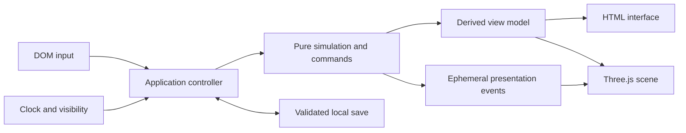

# Technical specification

## 1. Platform and dependency policy

Implement a static browser game under `slime-garden/` in the existing repository. Use `.mjs` modules and JSDoc annotations, native DOM/CSS for interface controls, and Three.js **0.180.0** for the scene. This matches the approved source and avoids introducing a bundler into a vanilla site. `.mjs` also lets the same pure modules run under Node's test runner without changing the root package's module mode.

Vendor the exact release's `build/three.module.js`, `build/three.core.js`, and MIT license under `slime-garden/vendor/three/`. Record origin URL, version, and downloaded SHA-256 values in `vendor/README.md`. The renderer module imports `./three.core.js`; copying only `three.module.js` will fail. This was verified in the [r180 source](https://raw.githubusercontent.com/mrdoob/three.js/r180/build/three.module.js). Import from the local vendor path and never from `latest`.

No backend, Firebase integration, account, telemetry service, payment dependency, service worker, runtime CDN, physics library, React wrapper, state-management library, or asset generation pipeline is needed. “Offline progress” means earning while away and reconciling on return; it does not promise that a first page load works without a network connection. Local static assets eliminate third-party runtime fetches after deployment.

Use a modern browser with WebGL2 for the intended visual experience. If 3D initialization fails, retain an accessible DOM management interface and explain that the 3D scene is unavailable. Do not let a renderer failure prevent save export or erase progression. Three.js documents its WebGL2 renderer requirements in [WebGLRenderer](https://threejs.org/docs/pages/WebGLRenderer.html); inspect the pinned source if current documentation differs from r180.

## 2. Planned file structure and ownership

```text
slime-garden/
  index.html
  styles.css
  README.md
  vendor/README.md
  vendor/three/{three.module.js,three.core.js,LICENSE}
  reference/{anime-slime-handoff.md,original-preview.html}
  src/main.mjs
  src/core/{balance,state,selectors,advance,commands,validate}.mjs
  src/persistence/{save-store,reconcile,tab-lock}.mjs
  src/ui/{dom,format,settings}.mjs
  src/scene/{scene,slime-actor,slime-pose,habitat,layout,motion,arrivals,quality}.mjs
  src/audio/audio.mjs
  tests/{state,advance,commands,reconcile,validation}.test.mjs
  tests/fixtures/*.json
  dev/{inspection,stress}.html
  docs/{implementation-log,qa-results}.md
```

These are planned implementation paths, not files created by this planning task. A file may be combined with an adjacent module if it remains small and ownership clear, but keep core, persistence, and rendering separated. Do not create placeholder modules with no behavior just to match the tree.

`main.mjs` wires dependencies, owns current state, performs startup and time reconciliation, serializes commands, and drives UI/scene updates. It is the only module allowed to orchestrate both economics and rendering. Core imports only core. Scene never imports persistence. Persistence validates plain JSON rather than Three objects.



## 3. State and invariants

`contracts.d.ts` is the public shape reference. Production state is JSON-compatible. It contains no meshes, matrices, functions, DOM nodes, callbacks, `Map`, `Set`, wall-clock-dependent getters, or animation objects.

Time is integer milliseconds on a **logical game clock**. A fresh game begins at `simTimeMs = 0`. Save checkpoint wall time is separate. Slime bonus and feed cooldown timestamps use logical time, so changing devices' locale or time zone cannot reinterpret them.

Starting state: `glowMicro=0`, `lifetimeGlowMicro=0`, `incomeRemainder=0`, `berries=6`, `nextBerryAtMs=15_000`, `nextFeedAllowedAtMs=0`, all upgrades zero, total feeds zero, initial `slime-1` in home slot zero with `createdAtMs=0`, `boostUntilMs=0`, and no feeds. Default names are “Slime 1” through “Slime 6.” `habitatId='garden-prototype-v1'`; `arrivalStyleId='visitor-v1'`.

Always enforce:

- All numeric state values are finite safe integers in their documented ranges.
- `0 <= glowMicro <= lifetimeGlowMicro <= 9e12`.
- `0 <= incomeRemainder < 1000`.
- Upgrades: shrub 0–3, pantry 0–2, Bloom 0–5, beds 0–4.
- Berry count is within capacity. If full, timer is null; otherwise timer is strictly after current simulation time and no more than one current berry interval ahead.
- Population is 1–6, does not exceed capacity, IDs are unique sequential values, and home slots are unique integers 0–5. Slot `n-1` belongs to resident `n` in v1.
- Individual feed counters are nonnegative; their sum equals total feeds. Cap accepted total feeds at 1e9; at that unreachable practical limit, further feeds retain effects but do not increase either counter.
- A future boost expiry is at most 300,000 ms away; an expired expiry is allowed and contributes no bonus. A future cooldown is at most 4,000 ms away.
- `createdAtMs <= simTimeMs`; simulation time and absolute logical timer values do not exceed 1e12 ms. Treat exhaustion of this roughly 31-year logical horizon as an unsupported save rather than allowing overflow.
- Tutorial IDs are unique members of the known list. Habitat and arrival identifiers must be supported.

Derived values—production rate, affordability, companion readiness, capacity, and boost remaining—come from selectors. Do not save a second copy. Persistent milestone claims are represented by actual population. No separate “reward claimed” flag is necessary.

## 4. Commands and transaction order

Expose only three economic commands: `FEED`, `BUY_UPGRADE`, and `WELCOME_COMPANION`. Settings and selection are controller/UI concerns. All dispatches are synchronous; no network requests or animation awaits occur inside a command.

For each input:

1. Settle simulation to the input's controller time.
2. Validate command shape and preconditions against the settled state.
3. Compute a new state and presentation events atomically.
4. Replace the controller state exactly once.
5. Update relevant DOM state immediately; reconcile the scene by resident ID.
6. Save immediately for a successful economic command.
7. Play presentation events after the state is committed.

The pure functions never mutate their input. A rejected `applyCommand` returns unchanged state and no gameplay events. The preceding time advance may legitimately have earned resources; do not confuse that with an invalid command charging a cost.

`FEED`: require an existing resident, a berry, and `simTimeMs >= nextFeedAllowedAtMs`. Deduct exactly one, restart the berry timer only if the basket was full, update counters and expiry, and emit `FED`. Apply feedback immediately rather than waiting for food to reach the mouth. Double clicks in the same frame fail the second cooldown check.

`BUY_UPGRADE`: require a known ID, `expectedLevel` matching current level, a remaining level, and the exact integer cost. Spend once, raise the level once, apply the track's berry-timer rule, and emit `UPGRADE_BOUGHT`. The expected-level guard prevents an old double-click from buying two levels after a DOM refresh race.

`WELCOME_COMPANION`: require `expectedPopulation` to match, population below six and capacity, and all next-milestone requirements. Create one stable ID with its slot and unboosted state. Do not spend currency, consume berries, subtract milestones, or schedule an economic spawn in the renderer. Emit `COMPANION_ADDED`. A duplicate request carrying the old population is stale.

Invalid strings or malformed objects return `INVALID_COMMAND`. There is no persisted command queue, asynchronous retry pipeline, or renderer callback that redispatches a command.

## 5. Deterministic time advancement

`advance(state, elapsedMs)` accepts an integer between zero and eight hours and returns new state, aggregate earnings, and any tutorial completion events. Zero time is a valid no-op. Reject invalid arguments at the module boundary in development/tests; the controller must sanitize clock inputs before invoking it.

Do **not** use a frame-based multiplier or step through 28,800 seconds for offline earnings. Integrate across the handful of times when income changes: resident bonus expiries. Berry regeneration has a closed-form calculation and does not affect the income rate.

For income:

1. Set `start=state.simTimeMs`, `end=start+elapsedMs`.
2. Collect unique bonus expiries strictly inside `(start,end)`; sort them; append `end`.
3. For each half-open interval `[cursor,boundary)`, evaluate production at `cursor` with `boostUntilMs > cursor`.
4. Compute `numerator = rateMicroPerSecond * (boundary-cursor) + incomeRemainder`.
5. Earn `Math.floor(numerator/1000)` integer micro-Glow and retain `numerator % 1000`.
6. Add earnings independently to wallet and lifetime totals with their caps. Do not derive lifetime increase from wallet increase when the wallet is capped. Reset the remainder to zero only once both counters are capped.
7. Move cursor to the boundary. At an expiry boundary the next interval uses the base multiplier.

With six residents, there are at most seven income segments per call. The largest supported rate × eight-hour interval is below JavaScript's safe-integer limit. Check the calculation in a test rather than introducing floating currency rounding.

For berries, if the timer is non-null and `nextBerryAtMs <= end`:

```text
due = 1 + floor((end - nextBerryAtMs) / intervalMs)
gained = min(due, capacity - berries)
berries += gained
nextBerryAtMs = null if full, otherwise oldNextBerryAtMs + due × intervalMs
```

An event exactly at `end` is processed before an input at that timestamp. Example: a berry due at 15,000 ms exists for a feed at 15,000 ms. Bonus income over `[0,120,000)` is boosted; income beginning at 120,000 ms is base.

Update `simTimeMs=end` and compute readiness via selectors. No automatic feed, upgrade purchase, or resident addition occurs during advancement. This makes online and offline accounting identical for intervals without commands.

Do not use an epsilon for resource arithmetic. A meaningful property test is chunk equivalence: advancing one interval or several partitions with no intervening command produces exactly the same state, including remainder and berry timer.

## 6. Visible clock, background time, and sleep

Use `performance.now()` for normal visible-session elapsed time and `Date.now()` only for save checkpoints and absence measurement. Browser animation callbacks may stop in hidden tabs; never depend on them to earn idle currency. See [requestAnimationFrame](https://developer.mozilla.org/en-US/docs/Web/API/Window/requestAnimationFrame), [Page Visibility](https://developer.mozilla.org/en-US/docs/Web/API/Page_Visibility_API), and [performance.now](https://developer.mozilla.org/en-US/docs/Web/API/Performance/now).

The controller maintains fractional visible milliseconds: add each monotonic delta to a carry, advance the integer part, and retain the fraction. Otherwise a 144 Hz display loses time through repeated truncation. Settle at roughly 100 ms intervals and before commands/saves; rendering remains independent at the selected frame rate.

Visibility transition to hidden: settle once, save a checkpoint, stop rendering and visible advancement, and record the wall baseline. Retain the active-tab lock. On returning: reconcile from that baseline once, save the reconciled state, reset both wall/monotonic samples and the fractional carry, and resume rendering. Never apply both a hidden interval and the same interval as a large first-frame delta.

If a visible loop resumes after a wall gap above 5 seconds (device sleep, process suspension, heavy freeze), route that gap through absence reconciliation from the last settled checkpoint and apply the eight-hour earning cap. Do not replay thousands of animation frames. Store an in-memory last-settled checkpoint at each controller update, not just each disk save. A difference between wall and monotonic clocks can flag this case, but monotonic ticking during OS sleep differs across browsers; use the large wall-gap rule consistently.

Wall-clock rollback yields zero offline elapsed, a nonfatal notice, and a new checkpoint at the current wall time. Forward jumps are limited by the eight-hour earning cap. This is a local cozy game: clock manipulation and save editing are not adversarial security problems to solve. Do not claim tamper resistance. Normal visible time continues using its monotonic clock after rebasing.

## 7. Offline reconciliation, exactly once per checkpoint

On cold startup, acquire writer ownership first, load the best valid save, then:

```text
awayMs = max(0, nowWallMs - savedWallMs)
creditedMs = min(awayMs, 28_800_000)
result = advance(savedState, creditedMs)
```

If `awayMs` exceeds credited time, the remaining time produces no resources but still ages logical time and timers. In this game, every possible bonus and feed cooldown has already expired and any berry basket has filled during the first eight hours. Assert those conditions, then jump `simTimeMs` forward by the remaining gap, leaving expired timers expired and the full berry timer null. Limit/reject gaps that would exceed the logical-time validation bound; do not overflow or loop over an absurd imported date.

Persist the resulting state with `savedWallMs=nowWallMs` **before showing** the welcome-back summary. The summary is informational; it has no Claim button and cannot award again. Show it for absences of at least 60 seconds and include actual gained Glow, berries, and a note when capped. Never replay old feeding, upgrade, or arrival animation events after load.

Example: one unboosted resident returning after one hour earns 360 Glow. The same resident boosted for the first 120 seconds earns 372 Glow. Returning after ten hours with no boost earns 2,880 Glow; all ten hours pass for timer expiry. An immediate reload after a successful reconciliation save adds only the newly elapsed real time, not another hour or eight hours.

If storage writes fail, keep advanced in-memory state, label it unsaved, and allow export. A later full reload may restore an older checkpoint because persistence was unavailable; do not claim an exactly-once guarantee across a failed save. Make this limitation visible rather than silently treating a failed write as saved.

## 8. Save system and recovery

Use game-specific keys on this shared website origin:

- `cozy-slime-mvp:primary:v1`
- `cozy-slime-mvp:backup:v1`

`localStorage` is synchronous, string-based, and scoped to origin; availability and exceptions need handling. File-URL behavior is not a supported runtime. See [MDN localStorage](https://developer.mozilla.org/en-US/docs/Web/API/Window/localStorage). Keep each validated envelope below 64 KiB and never use `localStorage.clear()`.

Save immediately after successful economic commands, settings changes, imports, resets, and offline reconciliation; also every 10 seconds while active and on `visibilitychange`/`pagehide`. Do not rely on unload as the only save opportunity. Store complete checkpoints, not independent resource keys.

Write protocol:

1. Validate and serialize the proposed new envelope completely in memory.
2. Preserve the most recent already-persisted valid checkpoint as backup. Usually this is the current primary, but if backup has a higher revision, leave that newer backup intact instead of overwriting it with an older primary. A backup failure should be recorded but does not forbid trying the primary.
3. Write the new primary in one `setItem` call; increment revision only for the installed envelope. Report “Saved” only if the primary succeeds.
4. Catch every storage exception; keep the session playable and expose export.

Load primary if valid; otherwise try backup. If both are valid but primary has a lower revision (unexpected interrupted/manual state), prefer the greater revision. Use `savedWallMs` only as a tie-breaker. Reconcile from that one checkpoint as a whole. Do not mix primary inventory with backup time.

If neither is valid, show a recovery screen with “Start new game,” “Import save,” and “Download unreadable save” when raw data exists. Preserve raw keys until the user chooses recovery. Never automatically overwrite a future-version save. A first visit with no keys is not a corruption case and starts normally.

Validation accepts a JSON string up to 64 KiB, parses it, checks `gameId`, schema/balance versions, numeric and cross-field invariants, string lengths (name maximum 32 characters), known enums, and array bounds. Reconstruct known fields into a fresh object; do not merge arbitrary imported properties. Reject unsupported future versions with a useful message. V1 needs a version switch, not fictitious migrations from formats that never existed.

Export settles and checkpoints first, then downloads a JSON Blob named `cozy-slime-save-YYYY-MM-DD.json` with MIME `application/json`; revoke the object URL afterward. Import reads a selected local file, validates it, previews population/Glow/saved date, then on replacement advances it under the same capped absence rules and installs a checkpoint at now. Reset replaces only this game's two keys and state after confirmation.

## 9. Multiple tabs

Use an exclusive same-origin Web Lock named `cozy-slime-mvp:writer`. Request with `ifAvailable: true` and keep the callback's promise unresolved while the page owns the session. Only a lock holder loads, reconciles, writes, imports, resets, or runs economic commands. Web Locks coordinate same-origin tabs; see [Web Locks API](https://developer.mozilla.org/en-US/docs/Web/API/Web_Locks_API).

If unavailable because another tab holds the lock, show a read-only snapshot with “This game is active in another tab” and a “Try again” button. Retry lock acquisition after the other page closes; reload/reconcile the latest save after acquiring. Do not automatically steal ownership, keep earning in both tabs, or invent a localStorage timestamp lease that races.

If the API itself is unsupported or blocked, use clearly labeled **session-only mode**, with export available and no localStorage writes. A supported browser is required for persistent single-writer play in v1. This explicit fallback is preferable to pretending simultaneous writes are safe. Lock loss/pagehide stops commands and saving; pages restored from back/forward cache reacquire ownership and reload before resuming.

## 10. UI and rendering schedule

Use one application animation loop; if using Three's `setAnimationLoop`, stop it on dispose and do not also run a nested `requestAnimationFrame`. Render updates receive clamped visual delta (maximum 50 ms), but economic advancement receives the full reconciled elapsed duration. A paused animation toggle affects only presentation.

DOM counters update at most 4 times/second plus immediately after commands. Do not rebuild the whole DOM with `innerHTML` per frame. Cache element references, update text and disabled states, and reconcile resident buttons by ID. Strings from saves use `textContent`. Preserve keyboard focus while numbers change.

Scene events are ephemeral. `scene.sync(state)` ensures the correct resident count even if an animation was skipped. `scene.play(events)` merely embellishes an already-committed state. Reload constructs residents at home slots without replaying arrivals. Selection is transient and falls back to the original resident after load.

UI remains usable before 3D initialization finishes. The scene can show a loading/error region; the controller must not create a second default save in response to a renderer exception. Listen for `webglcontextlost`, prevent default if restoration is intended, pause scene work, and reconstruct from current plain state on restoration; never reapply offline grants or commands.

## 11. Deployment integration

Local development can use the existing `npm start` static server. The game route is `/slime-garden/`; all game assets use relative paths such as `./src/main.mjs` and `../vendor/three/three.module.js` from the correct importing directory. There is no history router and no deep-route rewrite requirement.

The inspected workflow is `.github/workflows/deploy-pages.yml`, triggered by pushes to `master` and manual dispatch. Its staging step explicitly copies selected site folders into `_site`. Add an equivalent copy for `slime-garden` during the release work packet. Use a required copy once the folder is part of the release so a missing game fails the workflow visibly. Do not change Firebase setup or unrelated folder handling.

GitHub Pages supports workflow-built deployment artifacts; see [GitHub's publishing-source documentation](https://docs.github.com/en/pages/getting-started-with-github-pages/configuring-a-publishing-source-for-your-github-pages-site). A directory existing in Git does not by itself mean this repository's staged artifact contains it.

Add a site-navigation link only during final integration and follow existing styling. Do not change the home page or publish anything during the asset/economy spike. When an actual release is requested, verify HTTP success for the route and every vendored import, not only that the workflow is green.
